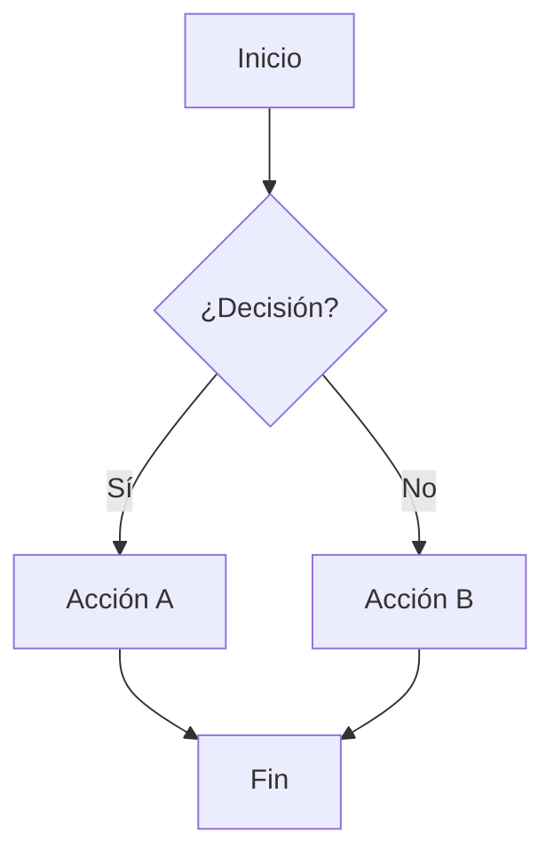

# 📚 Documentación Profesional con MkDocs


> Un proyecto de documentación profesional construido con MkDocs y Material Theme, listo para usar y altamente personalizable.

## ✨ Características

### 🎨 **Diseño Profesional**

- ✅ Tema Material Design responsive
- ✅ Modo claro y oscuro automático
- ✅ Navegación intuitiva con pestañas
- ✅ Búsqueda avanzada en español

### 📝 **Escritura Avanzada**

- ✅ Markdown enriquecido con extensiones
- ✅ Bloques de código con resaltado
- ✅ Matemáticas con MathJax
- ✅ Diagramas Mermaid integrados
- ✅ Admonitions (cajas de información)
- ✅ Pestañas de contenido

### 🔧 **Funcionalidades**

- ✅ Fechas de última modificación automáticas
- ✅ Optimización y minificación automática
- ✅ SEO optimizado
- ✅ Listo para GitHub Pages
- ✅ Personalización CSS/JS

## 🚀 Inicio Rápido

### 1. Requisitos Previos

```bash
# Python 3.8 o superior
python --version

# Git (opcional pero recomendado)
git --version
```

### 2. Instalación

```bash
# Clonar el repositorio
git clone https://github.com/tu-usuario/mkdocs-professional.git
cd mkdocs-professional

# Crear entorno virtual (recomendado)
python -m venv venv
venv\Scripts\activate  # Windows
# source venv/bin/activate  # macOS/Linux

# Instalar dependencias
pip install -r requirements.txt
```

### 3. Desarrollo Local

```bash
# Iniciar servidor de desarrollo
python -m mkdocs serve

# Abrir en navegador
# http://127.0.0.1:8000
```

### 4. Construcción

```bash
# Generar sitio estático
python -m mkdocs build

# Los archivos generados estarán en ./site/
```

## 📁 Estructura del Proyecto

```
mkDocs/
├── 📂 docs/                          # Contenido de documentación
│   ├── 📄 index.md                   # Página principal
│   ├── 📂 user-guide/                # Guía de usuario
│   │   ├── 📄 index.md
│   │   ├── 📄 introduction.md
│   │   ├── 📄 installation.md
│   │   └── 📄 configuration.md
│   ├── 📂 development/               # Documentación técnica
│   │   ├── 📄 index.md
│   │   ├── 📄 architecture.md
│   │   ├── 📄 api-reference.md
│   │   └── 📄 contributing.md
│   ├── 📂 examples/                  # Ejemplos prácticos
│   │   ├── 📄 index.md
│   │   ├── 📄 basic-examples.md
│   │   └── 📄 use-cases.md
│   ├── 📄 faq.md                     # Preguntas frecuentes
│   └── 📄 changelog.md               # Registro de cambios
├── 📂 overrides/                     # Personalizaciones del tema
├── 📂 stylesheets/                   # CSS personalizado
│   └── 📄 extra.css
├── 📂 javascripts/                   # JavaScript personalizado
│   ├── 📄 extra.js
│   └── 📄 mathjax.js
├── 📂 .github/                       # Configuración GitHub
│   └── 📄 copilot-instructions.md
├── 📄 mkdocs.yml                     # Configuración principal
├── 📄 requirements.txt               # Dependencias Python
└── 📄 README.md                      # Este archivo
```

## ⚙️ Configuración

### Personalización Básica

Edita `mkdocs.yml` para personalizar tu sitio:

```yaml
# Información básica
site_name: Tu Documentación
site_description: Descripción de tu proyecto
site_author: Tu Nombre
site_url: https://tu-sitio.com

# Tema y colores
theme:
  name: material
  palette:
    primary: indigo # Cambiar color principal
    accent: blue # Cambiar color de acento
```

### Agregar Contenido

1. **Crear nueva página**: Agrega un archivo `.md` en `docs/`
2. **Organizar en secciones**: Usa carpetas para agrupar contenido
3. **Actualizar navegación**: Modifica `nav:` en `mkdocs.yml`

### Personalizar Estilos

Edita `stylesheets/extra.css` para personalizar la apariencia:

```css
:root {
  --md-primary-fg-color: #tu-color;
}
```

## 🔌 Plugins Incluidos

| Plugin                | Descripción            | Configuración               |
| --------------------- | ---------------------- | --------------------------- |
| **search**            | Búsqueda avanzada      | Configurado para español    |
| **awesome-pages**     | Navegación mejorada    | Organización automática     |
| **git-revision-date** | Fechas de modificación | Formato datetime en español |
| **minify**            | Optimización           | HTML, CSS, JS automático    |

## 📊 Extensiones de Markdown

### Bloques de Código

```python title="ejemplo.py" linenums="1"
def hello_world():
    """Función de ejemplo."""
    print("¡Hola, mundo!")
    return True
```

### Admonitions

!!! tip "Consejo Profesional"
Usa admonitions para destacar información importante.

!!! warning "Advertencia"
Siempre revisa la configuración antes de desplegar.

### Pestañas

=== "Python"

    ```python
    print("Código en Python")
    ```

=== "JavaScript"

    ```javascript
    console.log("Código en JavaScript");
    ```

### Matemáticas

Ecuaciones inline: $E = mc^2$

Ecuaciones en bloque:

$$
\frac{d}{dx} \int_{a}^{x} f(t) dt = f(x)
$$

### Diagramas Mermaid



## 🚢 Despliegue

### GitHub Pages

```bash
# Configurar repository en GitHub
# Habilitar GitHub Pages en configuración del repo

# Desplegar
python -m mkdocs gh-deploy
```

### Netlify

1. Conectar repositorio a Netlify
2. Configurar build:
   - **Build command**: `mkdocs build`
   - **Publish directory**: `site`
3. Deploy automático en cada push

### Vercel

1. Importar proyecto desde GitHub
2. Vercel detecta automáticamente MkDocs
3. Deploy automático configurado

## 🛠️ Comandos Útiles

```bash
# Desarrollo
python -m mkdocs serve              # Servidor local
python -m mkdocs serve --dev-addr=0.0.0.0:8000  # Acceso desde red

# Construcción
python -m mkdocs build              # Build básico
python -m mkdocs build --clean      # Build limpio
python -m mkdocs build --strict     # Build con validación estricta

# Validación
python -m mkdocs config             # Verificar configuración
python -m mkdocs --help             # Ver ayuda

# Despliegue
python -m mkdocs gh-deploy          # GitHub Pages
python -m mkdocs gh-deploy --force  # Forzar actualización
```

## 🤝 Contribuir

1. **Fork** el repositorio
2. **Crear** rama para tu feature (`git checkout -b feature/nueva-funcionalidad`)
3. **Commit** tus cambios (`git commit -am 'Agregar nueva funcionalidad'`)
4. **Push** a la rama (`git push origin feature/nueva-funcionalidad`)
5. **Crear** Pull Request

## 📋 Lista de Tareas

- [x] Configuración inicial de MkDocs
- [x] Tema Material instalado y configurado
- [x] Plugins esenciales configurados
- [x] Estructura de documentación creada
- [x] Estilos personalizados implementados
- [x] JavaScript personalizado agregado
- [x] Contenido de ejemplo creado
- [x] README completo
- [ ] Tests automatizados
- [ ] CI/CD con GitHub Actions
- [ ] Plantillas de issues y PRs
- [ ] Documentación de API automática

## 🐛 Solución de Problemas

### Error: "mkdocs: command not found"

```bash
# Usar módulo de Python directamente
python -m mkdocs serve
```

### Error de permisos en Windows

```powershell
# Ejecutar como administrador
Set-ExecutionPolicy -ExecutionPolicy RemoteSigned -Scope CurrentUser
```

### Plugin no encontrado

```bash
# Reinstalar plugin específico
pip uninstall mkdocs-material
pip install mkdocs-material
```

### Sitio no se actualiza

```bash
# Limpiar cache y reconstruir
mkdocs build --clean
```

## 📚 Recursos Adicionales

- [📖 Documentación MkDocs](https://www.mkdocs.org/)
- [🎨 Material Theme](https://squidfunk.github.io/mkdocs-material/)
- [📝 Markdown Guide](https://www.markdownguide.org/)
- [🔌 PyMdown Extensions](https://facelessuser.github.io/pymdown-extensions/)
- [🎯 Ejemplos de Sitios](https://github.com/mkdocs/mkdocs/wiki/MkDocs-Users)

## 📄 Licencia

Este proyecto está bajo la Licencia MIT. Ver el archivo [LICENSE](LICENSE) para más detalles.

## 🙏 Agradecimientos

- [MkDocs](https://www.mkdocs.org/) por el excelente generador
- [Material Theme](https://squidfunk.github.io/mkdocs-material/) por el tema increíble
- [Python Markdown](https://python-markdown.github.io/) por las extensiones
- Comunidad open source por las contribuciones

---

**¿Encontraste útil este proyecto?** ⭐ ¡Dale una estrella en GitHub!

**¿Tienes preguntas?** 💬 [Abre un issue](https://github.com/tu-usuario/tu-repo/issues)
