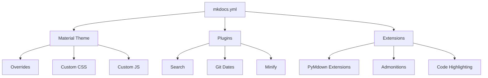
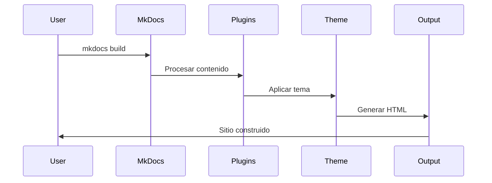

# Arquitectura del Proyecto

Esta sección describe la arquitectura y estructura técnica del proyecto de documentación.

## Estructura General

El proyecto sigue una arquitectura modular y escalable basada en las mejores prácticas de MkDocs:



## Componentes Principales

### 1. Configuración Central (`mkdocs.yml`)

El archivo de configuración central que define:

- **Metadatos del sitio**: Nombre, descripción, autor
- **Tema y personalización**: Material Theme con configuraciones avanzadas
- **Plugins**: Funcionalidades adicionales
- **Extensiones de Markdown**: Características de formato avanzadas
- **Navegación**: Estructura del sitio

### 2. Sistema de Temas

```yaml
theme:
  name: material
  custom_dir: overrides # Personalizaciones
  language: es # Idioma español
  features: # Características avanzadas
    - navigation.tabs
    - search.highlight
    - content.code.copy
```

### 3. Arquitectura de Plugins

Los plugins se ejecutan en orden específico:

1. **Search Plugin**: Indexación y búsqueda
2. **Awesome Pages**: Organización automática
3. **Git Revision Date**: Fechas de modificación
4. **Minify**: Optimización de archivos

### 4. Sistema de Extensiones

Las extensiones de Markdown se procesan en capas:

- **Básicas**: `toc`, `admonition`, `attr_list`
- **PyMdown**: Funcionalidades avanzadas
- **Superfences**: Bloques de código y diagramas
- **Tabbed**: Contenido en pestañas

## Flujo de Construcción



## Estructura de Archivos

### Organización del Contenido

```
docs/
├── index.md              # Página principal
├── user-guide/           # Documentación de usuario
│   ├── index.md
│   ├── introduction.md
│   ├── installation.md
│   └── configuration.md
├── development/          # Documentación técnica
│   ├── index.md
│   ├── architecture.md
│   ├── api-reference.md
│   └── contributing.md
├── examples/             # Ejemplos prácticos
│   ├── index.md
│   ├── basic-examples.md
│   └── use-cases.md
├── faq.md               # Preguntas frecuentes
└── changelog.md         # Registro de cambios
```

### Personalización

```
overrides/               # Personalizaciones del tema
stylesheets/            # CSS personalizado
├── extra.css          # Estilos adicionales
javascripts/           # JavaScript personalizado
├── mathjax.js        # Configuración MathJax
└── extra.js          # Scripts adicionales
```

## Patrones de Diseño

### 1. Separación de Responsabilidades

- **Contenido**: Archivos Markdown en `/docs`
- **Configuración**: `mkdocs.yml`
- **Presentación**: Tema Material + CSS/JS personalizado
- **Funcionalidad**: Plugins y extensiones

### 2. Convención sobre Configuración

El proyecto sigue convenciones estándar:

- Estructura de carpetas predecible
- Nombres de archivos descriptivos
- Configuración mínima necesaria

### 3. Extensibilidad

- Sistema de plugins modular
- Overrides para personalización
- CSS/JS personalizado
- Extensiones de Markdown

## Consideraciones de Performance

### 1. Optimización Automática

```yaml
plugins:
  - minify:
      minify_html: true
      minify_js: true
      minify_css: true
```

### 2. Carga Progresiva

- Material Theme incluye lazy loading
- Navegación instantánea
- Prefetch de páginas

### 3. SEO y Accesibilidad

- Meta tags automáticos
- Estructura semántica
- Soporte para lectores de pantalla
- URLs amigables

## Tecnologías Utilizadas

| Componente | Tecnología | Versión  |
| ---------- | ---------- | -------- |
| Generador  | MkDocs     | 1.6+     |
| Tema       | Material   | 9.6+     |
| Lenguaje   | Python     | 3.8+     |
| Formato    | Markdown   | Extended |
| Estilos    | CSS3       | Modern   |
| Scripts    | JavaScript | ES6+     |

## Próximos Pasos

1. **Monitoreo**: Implementar analytics y métricas
2. **CI/CD**: Automatizar despliegue
3. **Testing**: Validación de enlaces y contenido
4. **Internacionalización**: Soporte multi-idioma
