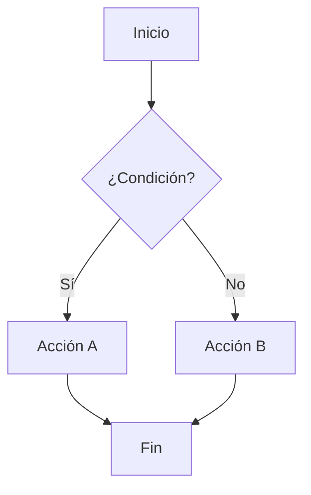
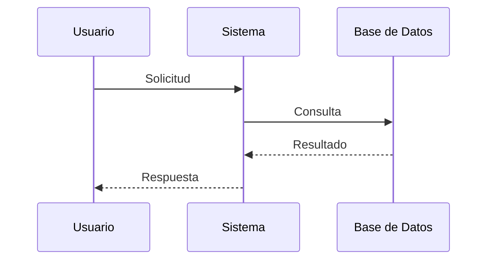

# Ejemplos Básicos

Esta sección contiene ejemplos fundamentales para ayudarte a entender y usar las características de MkDocs de manera efectiva.

## 📝 Formato de Texto

### Énfasis y Formato

```markdown
**Texto en negrita**
_Texto en cursiva_
**_Texto en negrita y cursiva_**
~~Texto tachado~~
==Texto resaltado==
```

**Resultado:**

- **Texto en negrita**
- _Texto en cursiva_
- **_Texto en negrita y cursiva_**
- ~~Texto tachado~~
- ==Texto resaltado==

### Superíndices y Subíndices

```markdown
H^2^O (agua)
CO~2~ (dióxido de carbono)
x^2^ + y^2^ = z^2^
```

**Resultado:**

- H^2^O (agua)
- CO~2~ (dióxido de carbono)
- x^2^ + y^2^ = z^2^

## 🔗 Enlaces

### Enlaces Básicos

```markdown
[Enlace a Google](https://google.com)
[Enlace a otra página](../user-guide/introduction.md)
[Enlace con título](https://ejemplo.com "Título del enlace")
```

### Enlaces de Referencia

```markdown
Este es un [enlace de referencia][1] y este es [otro][referencia].

[1]: https://ejemplo.com
[referencia]: https://otro-ejemplo.com "Título opcional"
```

## 📋 Listas

### Lista Simple

```markdown
- Elemento 1
- Elemento 2
  - Subelemento A
  - Subelemento B
- Elemento 3
```

### Lista Numerada

```markdown
1. Primer paso
2. Segundo paso
   1. Subpaso A
   2. Subpaso B
3. Tercer paso
```

### Lista de Tareas

```markdown
- [x] Tarea completada
- [ ] Tarea pendiente
- [x] Otra tarea completada
- [ ] Tarea por hacer
```

**Resultado:**

- [x] Tarea completada
- [ ] Tarea pendiente
- [x] Otra tarea completada
- [ ] Tarea por hacer

## 💻 Código

### Código Inline

```markdown
Usa la función `print()` para mostrar texto.
La variable `nombre` contiene el valor.
```

### Bloques de Código

````markdown
```python
def saludo(nombre):
    """Función que saluda a una persona."""
    return f"¡Hola, {nombre}!"

resultado = saludo("Mundo")
print(resultado)
```
````

### Código con Numeración

````markdown
```python linenums="1"
def calcular_area_circulo(radio):
    """Calcula el área de un círculo."""
    import math
    return math.pi * radio ** 2

# Ejemplo de uso
area = calcular_area_circulo(5)
print(f"El área es: {area:.2f}")
```
````

### Código con Título

````markdown
```python title="calculadora.py" linenums="1"
class Calculadora:
    def sumar(self, a, b):
        return a + b

    def restar(self, a, b):
        return a - b
```
````

## 📊 Tablas

### Tabla Básica

```markdown
| Nombre | Edad | Ciudad    |
| ------ | ---- | --------- |
| Juan   | 25   | Madrid    |
| María  | 30   | Barcelona |
| Pedro  | 35   | Valencia  |
```

**Resultado:**

| Nombre | Edad | Ciudad    |
| ------ | ---- | --------- |
| Juan   | 25   | Madrid    |
| María  | 30   | Barcelona |
| Pedro  | 35   | Valencia  |

### Tabla con Alineación

```markdown
| Izquierda | Centro | Derecha |
| :-------- | :----: | ------: |
| Texto     | Texto  |   Texto |
| Más texto | Centro |  123.45 |
```

**Resultado:**

| Izquierda | Centro | Derecha |
| :-------- | :----: | ------: |
| Texto     | Texto  |   Texto |
| Más texto | Centro |  123.45 |

## 🎨 Admonitions

### Tipos Básicos

```markdown
!!! note
Esta es una nota informativa.

!!! tip "Consejo Útil"
Este es un consejo con título personalizado.

!!! warning
Esta es una advertencia importante.

!!! danger "¡Peligro!"
Esta es una alerta de peligro crítico.
```

### Admonitions Colapsables

```markdown
??? example "Ejemplo Colapsable"
Este contenido está oculto por defecto.
Haz clic para expandir.

???+ info "Información Expandida"
Este contenido está visible por defecto.
Pero se puede colapsar.
```

## 🔄 Pestañas de Contenido

### Pestañas Básicas

````markdown
=== "Python"

    ```python
    print("¡Hola desde Python!")
    ```

=== "JavaScript"

    ```javascript
    console.log("¡Hola desde JavaScript!");
    ```

=== "Java"

    ```java
    System.out.println("¡Hola desde Java!");
    ```
````

**Resultado:**

=== "Python"

    ```python
    print("¡Hola desde Python!")
    ```

=== "JavaScript"

    ```javascript
    console.log("¡Hola desde JavaScript!");
    ```

=== "Java"

    ```java
    System.out.println("¡Hola desde Java!");
    ```

## 🧮 Matemáticas

### Fórmulas Inline

```markdown
La fórmula de Einstein es $E = mc^2$.
El teorema de Pitágoras: $a^2 + b^2 = c^2$.
```

### Fórmulas en Bloque

```markdown
$$
\begin{align}
f(x) &= ax^2 + bx + c \\
x &= \frac{-b \pm \sqrt{b^2 - 4ac}}{2a}
\end{align}
$$
```

**Resultado:**

$$
\begin{align}
f(x) &= ax^2 + bx + c \\
x &= \frac{-b \pm \sqrt{b^2 - 4ac}}{2a}
\end{align}
$$

## 📈 Diagramas

### Diagrama de Flujo

````markdown

````

### Diagrama de Secuencia

````markdown

````

## 🌟 Funciones Avanzadas

### Abreviaciones

```markdown
_[HTML]: HyperText Markup Language
_[CSS]: Cascading Style Sheets

HTML y CSS son tecnologías web fundamentales.
```

### Notas al Pie

```markdown
Este texto tiene una nota al pie[^1].

[^1]: Esta es la nota al pie con información adicional.
```

### Teclas del Teclado

```markdown
Presiona ++ctrl+c++ para copiar.
Usa ++alt+tab++ para cambiar ventanas.
++cmd+shift+p++ abre la paleta de comandos en VS Code.
```

**Resultado:**

- Presiona ++ctrl+c++ para copiar
- Usa ++alt+tab++ para cambiar ventanas
- ++cmd+shift+p++ abre la paleta de comandos en VS Code

## 🎯 Consejos Prácticos

### 1. Organización del Contenido

- Usa títulos jerárquicos (H1 → H6)
- Mantén párrafos cortos y claros
- Agrupa contenido relacionado

### 2. Accesibilidad

- Incluye texto alternativo en imágenes
- Usa colores con buen contraste
- Estructura el contenido lógicamente

### 3. SEO

- Usa títulos descriptivos
- Incluye palabras clave relevantes
- Crea enlaces internos entre páginas

### 4. Mantenimiento

- Revisa enlaces regularmente
- Actualiza ejemplos de código
- Mantén la información actualizada

¡Estos ejemplos te ayudarán a crear documentación profesional y atractiva! 🚀
