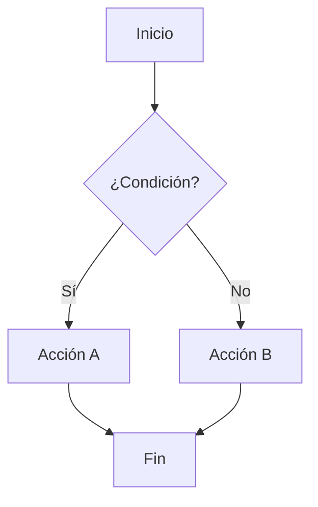

# Ejemplos

Ejemplos prácticos y casos de uso reales para aprovechar al máximo tu documentación.

## ¿Qué encontrarás aquí?

Esta sección contiene ejemplos concretos y casos de uso que te ayudarán a:

- Implementar patrones comunes de documentación
- Usar características avanzadas de MkDocs
- Crear contenido atractivo y útil

## Contenido disponible

- **[Ejemplos Básicos](basic-examples.md)**: Patrones fundamentales de escritura
- **[Casos de Uso](use-cases.md)**: Implementaciones reales y completas

## Ejemplos rápidos

### Callouts informativos

!!! example "Ejemplo"
Este es un ejemplo de cómo mostrar código con explicación.

```python
def ejemplo_funcion():
    """Función de ejemplo bien documentada."""
    return "¡Hola desde el ejemplo!"
```

### Pestañas con código

=== "Python"
`python
    print("Ejemplo en Python")
    `

=== "JavaScript"
`javascript
    console.log("Ejemplo en JavaScript");
    `

### Diagramas



## Recursos adicionales

- Visita la [documentación oficial de MkDocs](https://www.mkdocs.org/)
- Explora [Material for MkDocs](https://squidfunk.github.io/mkdocs-material/)
- Consulta ejemplos en [GitHub](https://github.com/mkdocs/mkdocs/wiki/MkDocs-Plugins)
