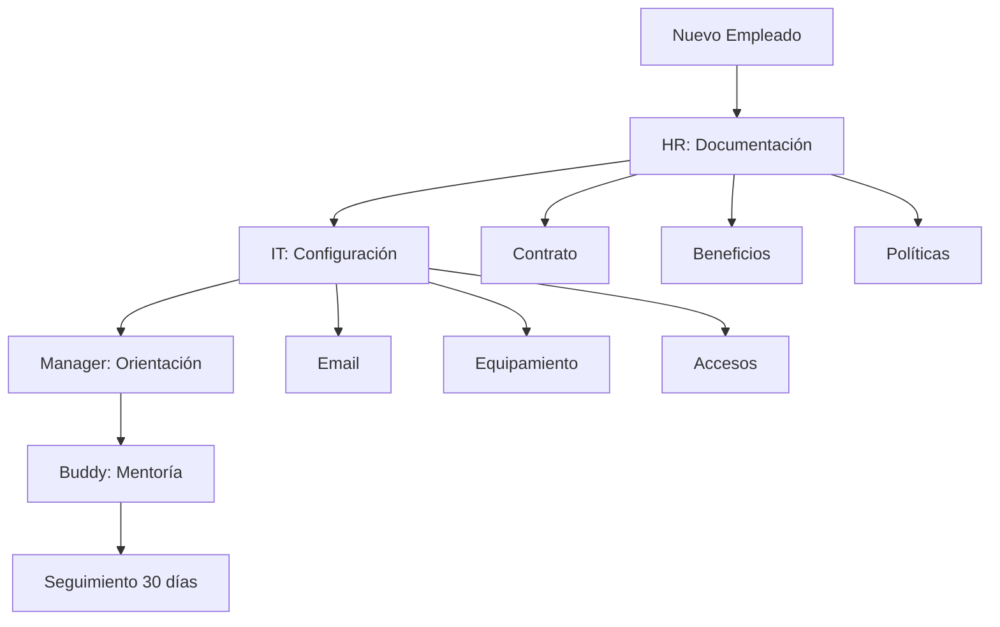

# Casos de Uso Reales

Esta sección presenta casos de uso reales y prácticos para aplicar MkDocs en diferentes contextos profesionales.

## 🏢 **Caso 1: Documentación de API**

### Contexto

Una empresa de desarrollo necesita documentar su API REST para desarrolladores externos.

### Implementación

#### Estructura Sugerida

```
docs/
├── api/
│   ├── index.md              # Introducción a la API
│   ├── authentication.md    # Autenticación
│   ├── endpoints/           # Endpoints por categoría
│   │   ├── users.md
│   │   ├── products.md
│   │   └── orders.md
│   ├── examples.md          # Ejemplos de uso
│   └── errors.md            # Códigos de error
```

#### Ejemplo de Documentación de Endpoint

````markdown
## POST /api/users

Crea un nuevo usuario en el sistema.

### Parámetros

| Parámetro | Tipo   | Requerido | Descripción        |
| --------- | ------ | --------- | ------------------ |
| name      | string | Sí        | Nombre del usuario |
| email     | string | Sí        | Email único        |
| age       | number | No        | Edad del usuario   |

### Ejemplo de Solicitud

```json
{
  "name": "Juan Pérez",
  "email": "juan@ejemplo.com",
  "age": 30
}
```

### Ejemplo de Respuesta

```json
{
  "id": 123,
  "name": "Juan Pérez",
  "email": "juan@ejemplo.com",
  "age": 30,
  "created_at": "2024-01-15T10:30:00Z"
}
```

### Códigos de Estado

| Código | Descripción                 |
| ------ | --------------------------- |
| 201    | Usuario creado exitosamente |
| 400    | Datos inválidos             |
| 409    | Email ya existe             |
````

---

## 🎓 **Caso 2: Manual de Usuario**

### Contexto

Una aplicación SaaS necesita un manual comprensivo para sus usuarios finales.

### Implementación

#### Estructura con Flujo de Usuario

```
docs/
├── getting-started/
│   ├── index.md
│   ├── registration.md
│   └── first-steps.md
├── features/
│   ├── dashboard.md
│   ├── reports.md
│   └── settings.md
├── tutorials/
│   ├── basic-workflow.md
│   └── advanced-features.md
└── troubleshooting/
    ├── common-issues.md
    └── contact-support.md
```

#### Ejemplo de Tutorial Paso a Paso

````markdown
# Tutorial: Crear tu Primer Reporte

Este tutorial te guiará para crear y personalizar tu primer reporte.

## Paso 1: Acceder al Módulo de Reportes

!!! tip "Antes de empezar"
Asegúrate de tener permisos de "Editor" o superiores.

1. Haz clic en **Reportes** en el menú principal
2. Selecciona **Nuevo Reporte**


## Paso 2: Configurar Datos Básicos

=== "Configuración Rápida"

    1. Selecciona **Plantilla de Ventas**
    2. Elige el rango de fechas
    3. Haz clic en **Generar**

=== "Configuración Avanzada"

    1. Selecciona **Reporte Personalizado**
    2. Define los campos necesarios:
       - Fuente de datos
       - Filtros avanzados
       - Agrupaciones
    3. Configura el formato de salida

!!! example "Ejemplo de Configuración"

    ```yaml
    Nombre: Ventas Mensuales
    Período: Último mes
    Agrupación: Por vendedor
    Formato: Gráfico de barras
    ```

## Paso 3: Personalizar Visualización

Para personalizar tu reporte:

- **Colores**: Usa la paleta corporativa
- **Gráficos**: Elige el tipo más apropiado
- **Filtros**: Agrega filtros interactivos
````

---

## 💻 **Caso 3: Documentación Técnica Interna**

### Contexto

Un equipo de desarrollo necesita documentar arquitectura, procesos y estándares.

### Implementación

#### Estructura para Equipos Técnicos

```
docs/
├── architecture/
│   ├── overview.md
│   ├── microservices.md
│   └── database-schema.md
├── development/
│   ├── setup.md
│   ├── coding-standards.md
│   └── deployment.md
├── operations/
│   ├── monitoring.md
│   ├── backup-procedures.md
│   └── incident-response.md
└── decisions/
    ├── adr-001-database-choice.md
    └── adr-002-framework-selection.md
```

#### Ejemplo de Architecture Decision Record (ADR)

````markdown
# ADR-001: Elección de Base de Datos

## Estado

Aceptado

## Contexto

Necesitamos seleccionar una base de datos para el nuevo microservicio de usuarios que maneje:

- Alto volumen de lecturas
- Transacciones ACID para operaciones críticas
- Escalabilidad horizontal futura

## Decisión

Elegimos PostgreSQL como base de datos principal.

## Consecuencias

### Positivas

- ✅ ACID compliance completa
- ✅ Excelente rendimiento en consultas complejas
- ✅ JSON nativo para datos flexibles
- ✅ Comunidad activa y documentación robusta

### Negativas

- ❌ Mayor complejidad de configuración vs SQLite
- ❌ Requerimientos de memoria más altos
- ❌ Curva de aprendizaje para el equipo

## Alternativas Consideradas

| Opción         | Pros                          | Contras               | Puntuación |
| -------------- | ----------------------------- | --------------------- | ---------- |
| MongoDB        | Escalabilidad, JSON nativo    | Consistencia eventual | 7/10       |
| MySQL          | Familiar al equipo            | Limitaciones JSON     | 6/10       |
| **PostgreSQL** | **ACID + JSON + Performance** | **Complejidad**       | **9/10**   |

## Implementación

```yaml
# docker-compose.yml
services:
  postgres:
    image: postgres:15
    environment:
      POSTGRES_DB: users_service
      POSTGRES_USER: app_user
      POSTGRES_PASSWORD: ${DB_PASSWORD}
    volumes:
      - postgres_data:/var/lib/postgresql/data
```
````

---

## 🔧 **Caso 4: Documentación de Proceso**

### Contexto

Una organización necesita documentar procesos operativos y procedimientos.

### Implementación

#### Estructura para Procesos

```
docs/
├── processes/
│   ├── onboarding/
│   │   ├── index.md
│   │   ├── hr-checklist.md
│   │   └── it-setup.md
│   ├── deployment/
│   │   ├── staging.md
│   │   └── production.md
│   └── incident-management/
│       ├── classification.md
│       └── escalation.md
```

#### Ejemplo de Proceso con Diagramas

````markdown
# Proceso de Onboarding

## Descripción General

El proceso de incorporación garantiza que los nuevos empleados tengan todo lo necesario para ser productivos desde el primer día.

## Flujo del Proceso



## Responsabilidades

### Recursos Humanos (Días -5 a 0)

!!! example "Checklist HR" - [ ] Preparar contrato de trabajo - [ ] Configurar beneficios en sistema - [ ] Enviar manual del empleado - [ ] Reservar espacio de trabajo - [ ] Notificar al equipo IT

### Tecnologías de Información (Día 0)

=== "Hardware"

    - [ ] Laptop configurada con SO corporativo
    - [ ] Monitor, teclado, mouse
    - [ ] Teléfono móvil corporativo (si aplica)
    - [ ] Tarjeta de acceso

=== "Software"

    - [ ] Cuenta de email corporativo
    - [ ] Acceso a sistemas internos
    - [ ] Licencias de software necesarias
    - [ ] VPN configurada

=== "Seguridad"

    - [ ] Autenticación de dos factores
    - [ ] Políticas de seguridad aplicadas
    - [ ] Backup inicial configurado

## Métricas de Éxito

| Métrica                 | Objetivo  | Medición                               |
| ----------------------- | --------- | -------------------------------------- |
| Tiempo de configuración | < 4 horas | Tiempo entre llegada y acceso completo |
| Satisfacción empleado   | > 4.5/5   | Encuesta día 7                         |
| Productividad inicial   | > 70%     | Evaluación manager día 30              |
````

---

## 📚 **Caso 5: Base de Conocimiento**

### Contexto

Un equipo de soporte necesita una base de conocimiento searchable y organizada.

### Implementación

#### Estructura de Knowledge Base

```
docs/
├── knowledge-base/
│   ├── categories/
│   │   ├── technical-issues.md
│   │   ├── billing-questions.md
│   │   └── product-features.md
│   ├── solutions/
│   │   ├── login-problems.md
│   │   ├── payment-failures.md
│   │   └── performance-issues.md
│   └── escalation/
│       ├── when-to-escalate.md
│       └── escalation-contacts.md
```

#### Ejemplo de Artículo de KB

````markdown
# Solución: Problemas de Inicio de Sesión

**Categoría**: Problemas Técnicos  
**Nivel**: Básico  
**Tiempo estimado**: 5-10 minutos

## Síntomas

- Usuario no puede acceder a su cuenta
- Mensaje "Credenciales inválidas"
- Página de login se recarga constantemente

## Diagnóstico Rápido

!!! question "Preguntas Clave" 1. ¿El usuario recuerda su email/usuario correctamente? 2. ¿Ha cambiado la contraseña recientemente? 3. ¿Funciona en modo incógnito? 4. ¿Hay problemas en otros dispositivos?

## Soluciones por Orden de Probabilidad

### 1. Verificar Credenciales (90% de casos)

=== "Problema de Email"

    ```
    Síntoma: "Usuario no encontrado"
    Solución:
    1. Verificar email sin espacios extra
    2. Probar con email alternativo
    3. Buscar en sistema por nombre/teléfono
    ```

=== "Problema de Contraseña"

    ```
    Síntoma: "Contraseña incorrecta"
    Solución:
    1. Reset de contraseña
    2. Verificar Caps Lock
    3. Probar contraseña anterior si cambió reciente
    ```

### 2. Limpiar Cache/Cookies (5% de casos)

```bash
# Instrucciones para el usuario
1. Abrir navegador en modo incógnito
2. Si funciona: limpiar cache y cookies
3. Chrome: Ctrl+Shift+Del > Todo el tiempo > Cookies e imágenes
```

### 3. Problemas de Cuenta (3% de casos)

!!! warning "Verificar Estado de Cuenta" - Cuenta suspendida por falta de pago - Cuenta bloqueada por seguridad - Necesita verificación de email

### 4. Problemas Técnicos (2% de casos)

Si las anteriores no funcionan:

1. **Verificar status del servicio**
2. **Revisar logs de servidor**
3. **Escalar a Nivel 2**

## Scripts de Comunicación

### Para Reset de Contraseña

> "Vamos a resolver esto rápidamente. Te voy a enviar un enlace para restablecer tu contraseña al email [EMAIL]. El enlace será válido por 24 horas. ¿Confirmamos que [EMAIL] es tu dirección actual?"

### Para Escalación

> "He revisado las soluciones estándar y necesito escalar tu caso a nuestro equipo especializado. Te contactarán en las próximas 2 horas hábiles con una solución específica."

## Escalación

| Condición                  | Acción                 |
| -------------------------- | ---------------------- |
| Problema persiste > 15 min | Escalar a L2           |
| Cuenta VIP/Enterprise      | Escalar inmediatamente |
| Problema de seguridad      | Escalar a InfoSec      |

## Métricas

- **Tiempo promedio resolución**: 3.2 minutos
- **Tasa de resolución primer contacto**: 94%
- **Satisfacción cliente**: 4.7/5
````

---

## 🎯 **Mejores Prácticas Generales**

### 1. Estructura Consistente

- Usa convenciones de nomenclatura claras
- Mantén jerarquía lógica de carpetas
- Incluye índices en cada sección

### 2. Contenido Orientado al Usuario

- Escribe desde la perspectiva del usuario
- Usa lenguaje claro y directo
- Incluye ejemplos prácticos

### 3. Mantenimiento Continuo

- Revisa y actualiza regularmente
- Solicita feedback de usuarios
- Monitores métricas de uso

### 4. Optimización para Búsqueda

- Usa palabras clave relevantes
- Incluye sinónimos comunes
- Estructura contenido para scanning

Estos casos de uso demuestran la versatilidad de MkDocs para diferentes necesidades documentales. ¡Adapta estos ejemplos a tu contexto específico! 🚀
